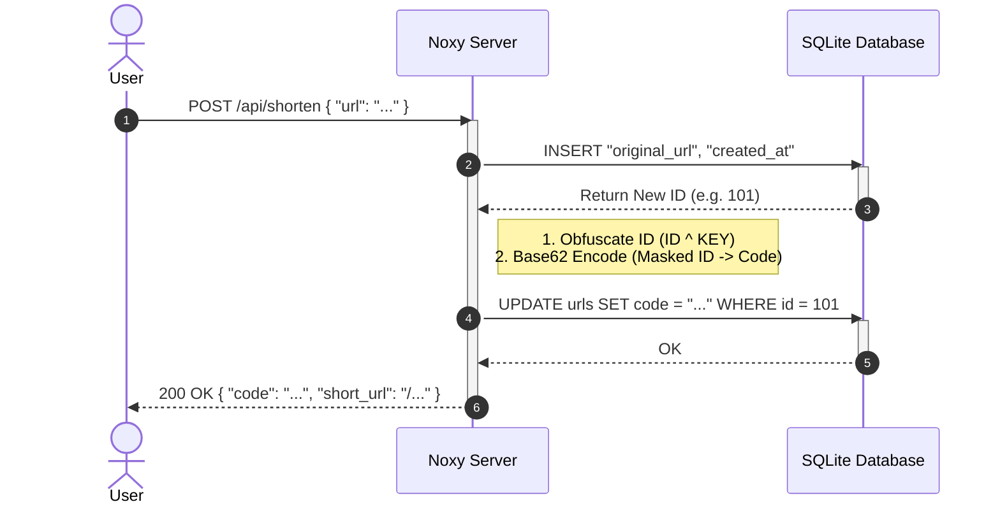

# Noxy URL Shortener

A high-performance, thread-safe URL shortener built entirely in **Noxy**.

This project serves as a showcase for the capabilities of the Noxy programming language, demonstrating how to build robust backend applications with minimal code.

## 🚀 Features implemented in Noxy

- **Parallel Processing**: Uses Noxy's `spawn()` and lightweight threads.
- **Thread-Safe SQLite**: Direct database access from concurrent handlers using the global `sqlite.Database`.
- **Native Web Server**: Built on Noxy's `http_server` module.
- **Obfuscated IDs**: Custom algorithm using native `base62_encode` and bitwise XOR operations to create professional short codes (e.g., `8M0v`) from sequential database IDs.
- **JSON API**: Native JSON parsing and response generation.


## 📊 How it Works



## 🛠️ The Code

The entire logic resides in a single file, `server_v3.nx`. It's clean, readable, and powerful.

### Handler Example

```javascript
func handle_shorten(body: bytes) -> HttpResponse
    // 1. Thread-safe DB Insert
    let res: sqlite.ExecResult = sqlite.execute_params(db, "INSERT INTO urls ...", params)
    let id: int = res.last_insert_id

    // 2. ID Obfuscation (XOR + Base62)
    let code: string = encode_id(id)

    // 3. Return JSON
    return response_json("{\"code\": \"" + code + "\"}")
end
```

## 📦 How to Run

1.  **Install Noxy**: Ensure you have a recent build of the Noxy VM.
2.  **Run the Server**:
    ```bash
    noxy server.nx
    ```
3.  **Test it**:
    In your browser, navigate to `http://127.0.0.1:8080` to see the shortener in action.

## 📚 About Noxy

Noxy is a new strongly-typed interpreted language designed for simplicity and concurrency. It features a Go-like syntax, garbage collection, and powerful standard libraries for modern web development.
